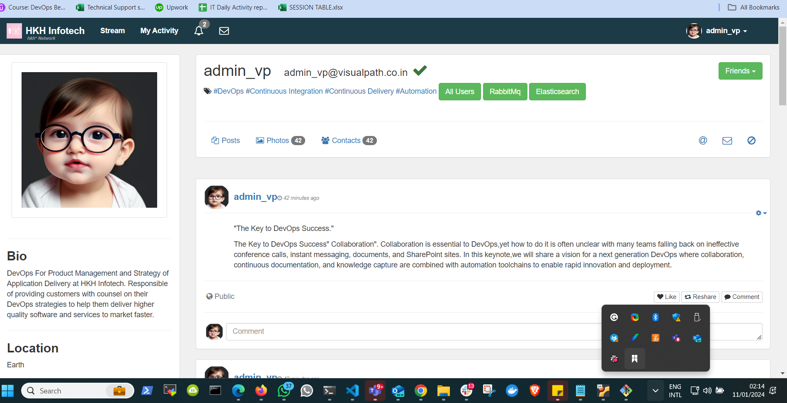

## MULTI-TIER WEB APPLICATION WITH DOCKER (JAVA)

**Project Design:**


This project is a 3-tier web application built with java.

Each tier are in folder named app, web and db. each has it's own docker file.

Its always a good practice to learn how these codes are deployed manually before you decided to create a dockerfile for it.

For manaual deployment, please check [here](https://github.com/nbomasi/vprofile-project-boma/blob/main/vagrant/Manual_provisioning_WinMacIntel/VprofileProjectSetupWindowsAndMacIntel.pdf)

The dockerfile for db is [here](Docker-files/db/Dockerfile)

The dockerfile for app is [here](Docker-files/app/Dockerfile)

The dockerfile for web is [here](Docker-files/web/Dockerfile)

**Client:** Client directory contains the files for the website "frontend" built on angular work.
The dockerfile for the frontend is located at [client-dockerfile](client/Dockerfile)

**javaapi:** This is the backend part of the application, and it is built with java and depends on the emartdb (MYSQL)

**nginx:** Act as the reverse proxy which connect the entire setup to the world

**nodeapi:** This is a nodejs backend  built with java script it depends on mongodb database system.

### Docker Compose

Each of the application has their docker file which is then called by the docker compose file [docker-compose](docker-compose.yml)

```markdown
docker compose up
```
docker compose build -d

The following microservices will be created (app, db and web). RabbitMQ and memcached images are pulled directly from their official dockerhub website.

This is configured in the docker compose file.

Note that the docker engine runs on aws ec2 instance, with http port 80 open on the ec2 security group.

Also note that all the credentials used in the compose.yaml file are located [here](src/main/resources/application.properties)

The webpage is shown below:




